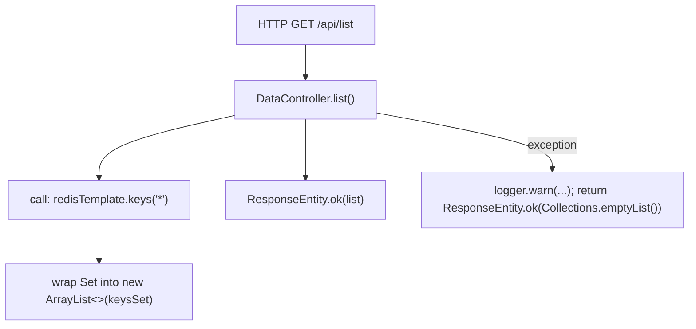
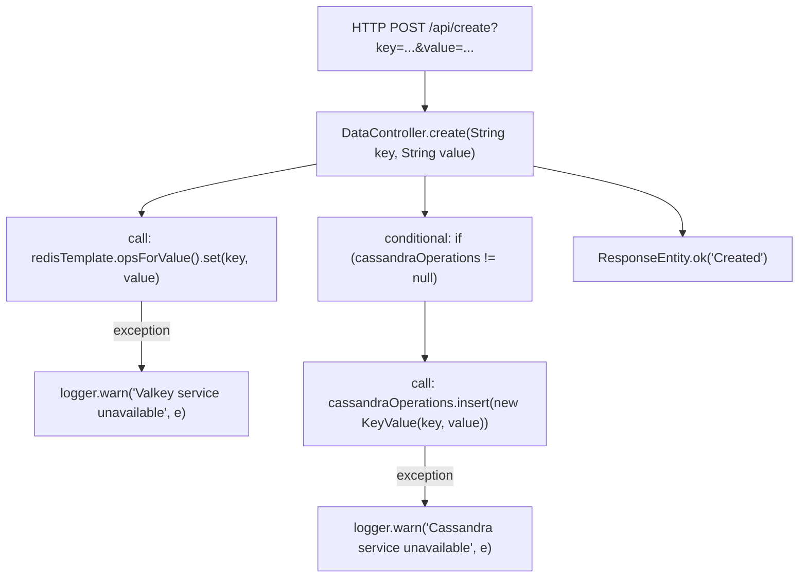

## MiradorStack Playground — Deep Dive: API Flow & Source Mapping

This document maps every REST API implemented in the codebase to the exact classes and methods that participate in handling the request. Each flow uses code-level hops so you can jump back to the source.

**Repository files referenced:**
 - [appserver/src/main/java/com/miradorstack/playground/DataController.java](appserver/src/main/java/com/miradorstack/playground/DataController.java)
 - [appserver/src/main/java/com/miradorstack/playground/KeyValue.java](appserver/src/main/java/com/miradorstack/playground/KeyValue.java)
 - [appserver/src/main/java/com/miradorstack/playground/PlaygroundApplication.java](appserver/src/main/java/com/miradorstack/playground/PlaygroundApplication.java)
 - [appserver/src/main/java/com/miradorstack/playground/OpenApiConfig.java](appserver/src/main/java/com/miradorstack/playground/OpenApiConfig.java)
 - [appserver/src/main/java/com/miradorstack/playground/RootRedirectController.java](appserver/src/main/java/com/miradorstack/playground/RootRedirectController.java)

---

**Notes about methodology**
 - All hops and function names below are taken directly from the source files linked above. No behavior beyond the code was assumed.

---

## Common building blocks (source-level)

 - `DataController` (see [DataController.java](appserver/src/main/java/com/miradorstack/playground/DataController.java))
	 - REST controller that provides all `/api` endpoints.
	 - Uses an injected `RedisTemplate<String,String>` field named `redisTemplate`.
	 - Uses an injected `CassandraOperations` field named `cassandraOperations` (nullable; `@Autowired(required = false)`).
	 - Logger: private static final `logger` (SLF4J) used for `logger.warn(...)` on exceptions.
 - `KeyValue` (see [KeyValue.java](appserver/src/main/java/com/miradorstack/playground/KeyValue.java))
	 - POJO mapped to Cassandra table `key_value`.
	 - Primary fields: `key` (primary key) and `value` with getters/setters and constructors.
 - `PlaygroundApplication` (see [PlaygroundApplication.java](appserver/src/main/java/com/miradorstack/playground/PlaygroundApplication.java))
	 - Main Spring Boot application entrypoint. Cassandra auto-config is explicitly excluded via `@SpringBootApplication(exclude = {CassandraAutoConfiguration.class, CassandraDataAutoConfiguration.class})`.
 - `OpenApiConfig` (see [OpenApiConfig.java](appserver/src/main/java/com/miradorstack/playground/OpenApiConfig.java))
	 - Defines an `OpenAPI` bean used by springdoc to provide API docs.
 - `RootRedirectController` (see [RootRedirectController.java](appserver/src/main/java/com/miradorstack/playground/RootRedirectController.java))
	 - Redirects root (`/`) to the Swagger UI: `redirectToSwagger()` returns `new RedirectView("/swagger-ui/index.html")`.

---

## API-by-API deep dives

Important: every flow below uses only classes/method names present in the project or explicitly invoked by them. External library method names are included where invoked directly in source.

1) GET /api/read/{key}

Mermaid flowchart (code-level hops):

```mermaid
flowchart TD
  A[HTTP GET /api/read/{key}]
  B["DataController.read(String key)"]
  A --> B
  B --> C1["call: redisTemplate.opsForValue().get(key)"]
  B --> C2["conditional: if (cassandraOperations != null)"]
  C2 --> D1["call: cassandraOperations.selectOneById(key, KeyValue.class)"]
  D1 --> E1["KeyValue.getValue() if result != null"]
  C2 -->|else| E2[put "Service unavailable" for cassandra]
  C1 --> F1["map valkey -> result.put('valkey', value or 'Not found')"]
  D1 --> F2["map cassandra -> result.put('cassandra', value or 'Not found')"]
  B --> G["return ResponseEntity.ok(result)"]
```

Hops explained (source references):
 - Request: `GET /api/read/{key}` mapped by `@GetMapping("/read/{key}")` in `DataController.read` ([DataController.java]).
 - `DataController.read` constructs `Map<String,String> result`.
 - Valkey path: calls `redisTemplate.opsForValue().get(key)` — result placed into `result.put("valkey", ...)`. On exception `logger.warn("Valkey service unavailable", e)` and places `"Service unavailable"`.
 - Cassandra path: if `cassandraOperations` is non-null, calls `cassandraOperations.selectOneById(key, KeyValue.class)`. If `kv != null` uses `kv.getValue()`; otherwise uses `"Not found"`. On exception `logger.warn("Cassandra service unavailable", e)` and places `"Service unavailable"`.
 - Final response created with `ResponseEntity.ok(result)`.

2) GET /api/list

Mermaid flowchart:



Hops explained:
 - Request: `@GetMapping("/list")` -> `DataController.list()`.
 - `list()` calls `redisTemplate.keys("*")` and returns the keys as a `List<String>` (new ArrayList from the returned Set).
 - On exception, logs `Valkey service unavailable` and returns an empty list via `ResponseEntity.ok(Collections.emptyList())`.

3) POST /api/create (parameters: `key`, `value`)

Mermaid flowchart:



Hops explained:
 - Request: `@PostMapping("/create")` -> `DataController.create(...)`.
 - Valkey path: stores value with `redisTemplate.opsForValue().set(key, value)`. Exceptions are caught and logged.
 - Cassandra path: if `cassandraOperations` is present, creates `new KeyValue(key, value)` and calls `cassandraOperations.insert(...)`. Exceptions are caught and logged.
 - Returns `ResponseEntity.ok("Created")` unconditionally.

4) PUT /api/modify/{key} (param: `value`)

Mermaid flowchart:

```mermaid
flowchart TD
  A[HTTP PUT /api/modify/{key}?value=...]
  B["DataController.modify(String key, String value)"]
  A --> B
  B --> C["call: redisTemplate.hasKey(key)"]
  C -->|true| D1["call: redisTemplate.opsForValue().set(key, value)"]
  D1 --> D2["if cassandraOperations != null -> cassandraOperations.update(new KeyValue(key, value))"]
  D2 -->|exception| D2e["logger.warn('Cassandra service unavailable', e)"]
  C -->|false| E["ResponseEntity.notFound().build()"]
  B -->|Valkey exception| F["logger.warn(...); return ResponseEntity.ok('Modified (Valkey unavailable)')"]
  D1 --> G["ResponseEntity.ok('Modified')"]
```

Hops explained:
 - Request: `@PutMapping("/modify/{key}")` -> `DataController.modify(...)`.
 - Existence check: `redisTemplate.hasKey(key)`. If false -> return 404 via `ResponseEntity.notFound().build()`.
 - If exists: update cache with `redisTemplate.opsForValue().set(key, value)`. Then, if `cassandraOperations` present, attempt `cassandraOperations.update(new KeyValue(key, value))` (exceptions logged).
 - If the initial `redisTemplate` operations throw an exception, the catch logs and returns `ResponseEntity.ok("Modified (Valkey unavailable)")`.

5) DELETE /api/delete/{key}

Mermaid flowchart:

```mermaid
flowchart TD
  A[HTTP DELETE /api/delete/{key}]
  B["DataController.delete(String key)"]
  A --> B
  B --> C1["call: redisTemplate.delete(key)"]
  C1 -->|exception| C1e["logger.warn('Valkey service unavailable', e)"]
  B --> C2["if cassandraOperations != null -> cassandraOperations.deleteById(key, KeyValue.class)"]
  C2 -->|exception| C2e["logger.warn('Cassandra service unavailable', e)"]
  B --> D["ResponseEntity.ok('Deleted')"]
```

Hops explained:
 - Request: `@DeleteMapping("/delete/{key}")` -> `DataController.delete(...)`.
 - Deletes from Valkey with `redisTemplate.delete(key)` (exceptions logged).
 - If `cassandraOperations` present, calls `cassandraOperations.deleteById(key, KeyValue.class)` (exceptions logged).
 - Returns `ResponseEntity.ok("Deleted")`.

---

## Other implementation notes (source-level facts)

 - `CassandraOperations` is `@Autowired(required = false)` in `DataController` so the code actively tolerates a missing Cassandra bean — the controller checks `if (cassandraOperations != null)` before using it.
 - `PlaygroundApplication` explicitly excludes Cassandra auto-configuration. This means Cassandra beans will not be auto-configured by Spring Boot unless configuration elsewhere re-enables them.
 - The project includes `spring-boot-starter-data-redis` and `spring-boot-starter-data-cassandra` in `pom.xml` (see [appserver/pom.xml](appserver/pom.xml)). The code uses the specific API surface of `RedisTemplate` and `CassandraOperations`.

---

## Quick source lookup
 - `DataController` implementation: [appserver/src/main/java/com/miradorstack/playground/DataController.java](appserver/src/main/java/com/miradorstack/playground/DataController.java)
 - `KeyValue` model: [appserver/src/main/java/com/miradorstack/playground/KeyValue.java](appserver/src/main/java/com/miradorstack/playground/KeyValue.java)
 - Application main: [appserver/src/main/java/com/miradorstack/playground/PlaygroundApplication.java](appserver/src/main/java/com/miradorstack/playground/PlaygroundApplication.java)
 - OpenAPI config: [appserver/src/main/java/com/miradorstack/playground/OpenApiConfig.java](appserver/src/main/java/com/miradorstack/playground/OpenApiConfig.java)
 - Root redirect: [appserver/src/main/java/com/miradorstack/playground/RootRedirectController.java](appserver/src/main/java/com/miradorstack/playground/RootRedirectController.java)

---

If you'd like, I can now:
 - Add line-numbered references into each hop for quicker navigation.
 - Produce printable PNG/SVG versions of the mermaid diagrams.
 - Run a quick local smoke test (if you want me to start the app here).

----

Generated from the repository source (no assumptions beyond code).
